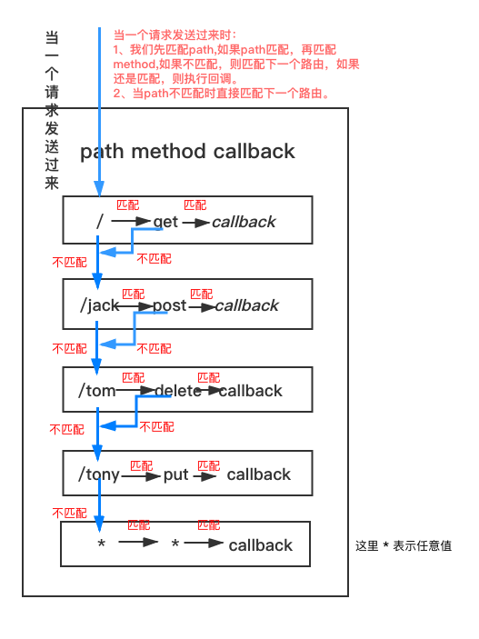

# 一、简介

<blockquote style='padding: 10px; font-size: 1em; margin: 1em 0px; color: rgb(0, 0, 0); border-left: 5px solid rgba(0,189,170,1); background: rgb(239, 235, 233);line-height:1.5;'>
<a href="https://www.expressjs.com.cn/">ExpressJs</a>是一个基于 Node.js 平台，快速、开放、极简的 Web 开发框架，有的前端的小伙伴会说这不是用Node做后台时经常用的框架吗，我学这个干嘛，我又不做后端，其实在我们的项目中无时无刻不运用了这个框架，<a href="https://webpack.docschina.org/configuration/dev-server/">webpack-dev-server</a>内部就使用了这个框架，常见的有以下配置：
</blockquote>

```js
//webpack.config.js
var path = require('path');

module.exports = {
  //...
  devServer: {
    contentBase: path.join(__dirname, 'dist'),
    compress: true,
    port: 9000,
    open: true
  },
};
```
<blockquote style='padding: 10px; font-size: 1em; margin: 1em 0px; color: rgb(0, 0, 0); border-left: 5px solid rgba(0,189,170,1); background: rgb(239, 235, 233);line-height:1.5;'>
webpack配置了这行代码，就会自动打开浏览器，运行localhost:9000进行业务上的开发，底层就用到了express框架，是不是对其实现原理颇有点兴趣？不过我们这节课先不说webpack-dev-server，先将他的底层express弄清楚。
</blockquote>

# 二、Hello World实现-实现最简单的Express

<blockquote style='padding: 10px; font-size: 1em; margin: 1em 0px; color: rgb(0, 0, 0); border-left: 5px solid rgba(0,189,170,1); background: rgb(239, 235, 233);line-height:1.5;'>
我们进入自己新建的test文件夹下，执行npm init -y 生成一个基本的node项目，进入这个项目下，执行npm install express -D 新建index.js文件，根据官网例子我们写出Hello World的Demo。
</blockquote>

```js
//index
const express = require('express')
const app = express()
const port = 3000

app.get('/', (req, res) => {
  res.send('Hello World!')
})

app.listen(port, () => {
  console.log(`Example app listening at http://localhost:${port}`)
})
```
<blockquote style='padding: 10px; font-size: 1em; margin: 1em 0px; color: rgb(0, 0, 0); border-left: 5px solid rgba(0,189,170,1); background: rgb(239, 235, 233);line-height:1.5;'>
如果上面的代码你成功运行控制台应该会出现<code>Example app listening at http://localhost:3000</code>，那你有没有和我一样产生了好奇呢，短短的几句话就能创建一个简易的服务器？会不会觉得很复杂，其实不然，这个框架内部其实是借由了Node底层模块-http模块。<br /><br />
通过http模块的<a href="http://nodejs.cn/api/http.html#http_http_createserver_options_requestlistener">createServer</a>方法会创建一个server实例，其中createServer本身可以接受一个回调函数作为参数，会被自动添加到<code>'<a href="http://nodejs.cn/api/http.html#http_event_request">request</a>'</code>事件上，实例上存在一个可以监听连接(post、get)的方法<a href="http://nodejs.cn/api/net.html#net_server_listen">listen</a>。<br /><br />
我们可以通过http.createServer来实现一个简单的服务器demo。
</blockquote>

```js
//http.js
const http=require('http');

let port=3000;

const server=http.createServer(function(req,res){
    res.setHeader('Content-Type', 'text/html; charset=utf-8')
    //请求的 URL 字符串
    if(req.url==='/'){
        res.end("我是http创建的");
    }else{
        res.writeHead(404)
        res.end('Can get / ');
    }
    
});

server.listen(port,function(req,res){
    console.log(`Example app listening at http://localhost:${port}`)
}) 
```
<blockquote style='padding: 10px; font-size: 1em; margin: 1em 0px; color: rgb(0, 0, 0); border-left: 5px solid rgba(0,189,170,1); background: rgb(239, 235, 233);line-height:1.5;'>
执行<code>node http.js</code>如果上面的代码你成功运行控制台应该会出现<code>Example app listening at http://localhost:3000</code>，浏览器打开3000端口会出现<code>我是http创建的</code>其中<a href="http://nodejs.cn/api/http.html#http_response_setheader_name_value">response.setHeader(name, value)</a>可以设置响应头。<br /><br />
当然express也绝没有这么简单，不然还不如直接用http Api了，个人觉得express最强大的功能是路由功能，可以通过<code>express().get('/xx')、express().post('/xx')</code>来拦截。
</blockquote>

# 三、Express最核心的功能-路由

<blockquote style='padding: 10px; font-size: 1em; margin: 1em 0px; color: rgb(0, 0, 0); border-left: 5px solid rgba(0,189,170,1); background: rgb(239, 235, 233);line-height:1.5;'>
在上一小节中，我们使用了http模块来实现了一个和express一样的功能，而express最核心的功能我认为是路由功能，即get、post方法即可注册路由，如果是原生http写的话，可能大部分同学会变成if else工程师，代码不仅不优雅而且难以维护，而express则简单的封装了一个路由的功能，回想一下我们写的一些express注册路由的代码：
</blockquote>

```js
//router.js
const express=require("express");
const app=express();

app.get('/',(req,res)=>{
    res.send("你访问了/")
})

app.post('/jack',(req,res)=>{
    res.send("你访问了/jack")
})

app.delete('/tom',(req,res)=>{
    res.send("你访问了/tom")
})

app.put('/tony',(req,res)=>{
    res.send("你访问了/tony")
})

app.listen(3000,()=>{
    console.log("我正在监听....")
})
```

<blockquote style='padding: 10px; font-size: 1em; margin: 1em 0px; color: rgb(0, 0, 0); border-left: 5px solid rgba(0,189,170,1); background: rgb(239, 235, 233);line-height:1.5;'>
由以上代码我们可以得知express是一个函数，且返回一个实例，实例上存在一些方法如<code>post、delete、get、put、listen</code>方法，我们可以大体写出一些框架代码：
</blockquote>

```js
module.exports=function createApplication(){ 
    return {
        get:function(){
            
        },
        post:function(){

        },
        delete:function(){

        },
        put:function(){

        },
        listen:function(){

        }
    } 
}
```

<blockquote style='padding: 10px; font-size: 1em; margin: 1em 0px; color: rgb(0, 0, 0); border-left: 5px solid rgba(0,189,170,1); background: rgb(239, 235, 233);line-height:1.5;'>
在脑海中回想路由，区别于前端路由，对于后端路由来说，当接收到客户端发来的HTTP请求，会根据请求的URL，来找到相应的路由，然后执行路由对应的回调函数，并将函数的返回值发送给客户端，我们可以抽象出下面这张图。
</blockquote>



<blockquote style='padding: 10px; font-size: 1em; margin: 1em 0px; color: rgb(0, 0, 0); border-left: 5px solid rgba(0,189,170,1); background: rgb(239, 235, 233);line-height:1.5;'>
由上图，我们可以看出将路由存在一个类似栈形结构中，当请求被服务端接受时，我们就可以从上向下依此匹配，当同时匹配到路径和方法时，就执行对应的回调函数。那么这个依此“向下匹配“的操作我们应该如果编写我们的代码呢？我们很容易想到for循环，如果匹配到就执行函数并且返回，最后一个为没有匹配到的404。<br /><br />
我们新建lib/express来仿写我们的express，由上大概可以写出下面的代码，将router.js的express换成lib/express.js，并将send改成end（原生http中的res没有send这个方法），可以发现我们已经完美了相同的效果。
</blockquote>

```js
//lib/express.js

const http=require('http');

module.exports=function createApplication(){

    let app={};

    let routers=[];
 
    for(let i=0;i<http.METHODS.length;i++){
        //http.METHODS定义了所有的http方法，需要转化为小写，别问为什么是大写，问就是规范
        app[http.METHODS[i].toLowerCase()]=function(path,callback){
            routers.push({
                path,
                method:http.METHODS[i],
                callback
            })
        }
    }

    let server=http.createServer(function(req,res){  
        const { method,url }=req; 
        for(let i=1;i<routers.length;i++){
            const { path,method:RouterMethod,callback }=routers[i];
            if(path===url && RouterMethod===method){
                return callback(req,res);
            } 
        }
        return routers[0].callback(req,res);
    })

    app.listen=function(){
        server.listen(...arguments);
    }
 
    routers.push({
        path:"*",
        method:"*",
        callback:function(req,res){
            res
                .writeHead(404)
                .end(`Cannot ${req.method} ${req.url}`)
        }
    })  

    return app;

} 
```

# 四、Application应用层使用类封装

<blockquote style='padding: 10px; font-size: 1em; margin: 1em 0px; color: rgb(0, 0, 0); border-left: 5px solid rgba(0,189,170,1); background: rgb(239, 235, 233);line-height:1.5;'>
在我们上面的lib/express中我们仿写了express的部分功能没有，其实就是2部分，创建应用，返回应用。我们的名字createApplication（创建应用）很好的印证了这一点，我们可以看下express的源码，可以看见其实他内部创建应用的这个过程其实是写在application.js文件里面，我们知道一个很好的库最重要的一点就是封装做得好，那我们这节就试着将创建应用的这个过程封装成一个类吧。<br /><br />
新建lib/application.js文件，将创建应用的细节过程封装进这个方法里面，在主文件只引入。
</blockquote>

```js
//lib/application.js
const http=require('http');

function Application(){
    
    this._router=[{
        path:"*",
        method:"*",
        callback:function(req,res){
            res
                .writeHead(404)
                .end(`Cannot ${req.method} ${req.url}`)
        }
    }];
}

for(let i=0;i<http.METHODS.length;i++){
    //http.METHODS定义了所有的http方法，需要转化为小写，别问为什么是大写，问就是规范
    Application.prototype[http.METHODS[i].toLowerCase()]=function(path,callback){
        this._router.push({
            path,
            method:http.METHODS[i],
            callback
        })
    }
} 

Application.prototype.listen=function(){
    const self=this;
    let server=http.createServer(function(req,res){  
        const { method,url }=req; 
        for(let i=1;i<self._router.length;i++){
            const { path,method:RouterMethod,callback }=self._router[i];
            if(path===url && RouterMethod===method){
                return callback(req,res);
            } 
        }
        return self._router[0].callback(req,res);
    })
 
    server.listen(...arguments);
    
}

module.exports=Application;
//---------------------------------------------------------------------------------
//lib/express.js
const Application=require('./Application');

module.exports=function createApplication(){
 
    return new Application();

}
```

<blockquote style='padding: 10px; font-size: 1em; margin: 1em 0px; color: rgb(0, 0, 0); border-left: 5px solid rgba(0,189,170,1); background: rgb(239, 235, 233);line-height:1.5;'>
运行代码我们可以发现实现了一模一样的效果！
</blockquote>

